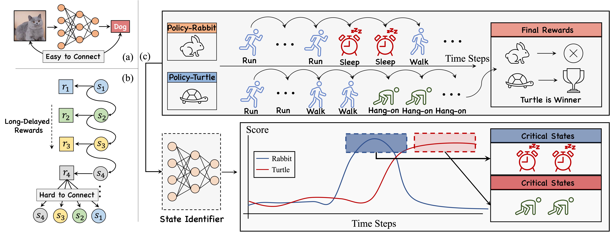
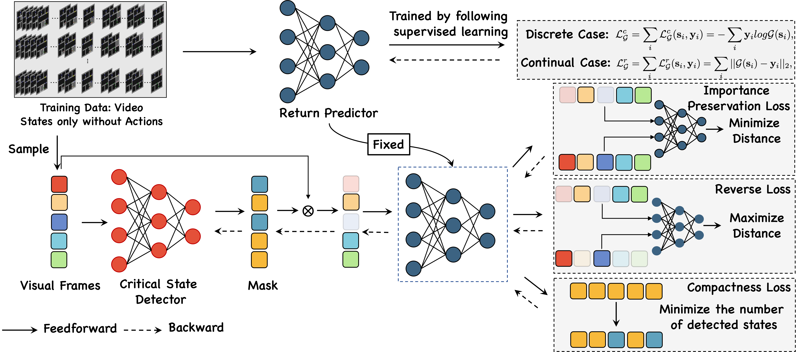
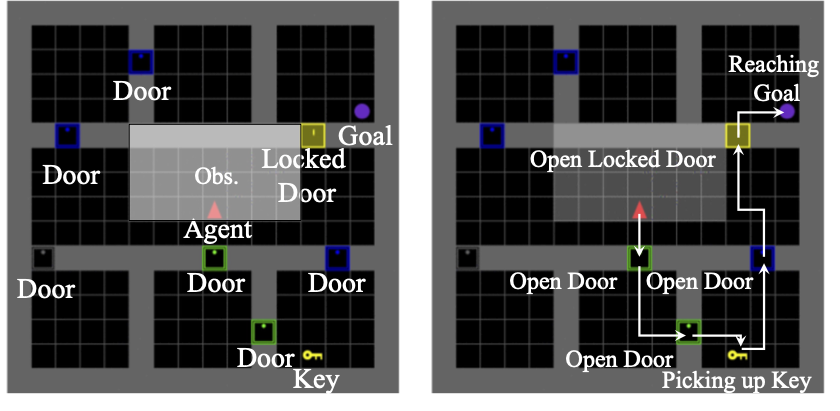

# Learning to Identify Critical States for Reinforcement Learning from Videos

This repository provides the official PyTorch implementation and Datasets for the [following paper](https://arxiv.org/pdf/2308.07795.pdf):

> **Abstract:** *Recent work on deep reinforcement learning (DRL) has pointed out that algorithmic information about good policies can be extracted from offline data which lacks explicit information about executed actions. For example, candid videos of humans or robots may convey a lot of implicit information about rewarding action sequences, but a DRL machine that wants to profit from watching such videos must first learn by itself to identify and recognize relevant states/actions/rewards. Without relying on ground-truth annotations, our new method called Deep State Identifier learns to predict returns from episodes encoded as videos. Then it uses a kind of mask-based sensitivity analysis to extract/identify important critical states.  Extensive experiments showcase our method's potential for understanding and improving agent behavior.*




## Data Repository

### Dataset 

#### GridWorld

* Generate Code: 

```
./Dataset/data_generation.py
```

* GridWorld-S (Training Set: 2000 Trajs | Test Set: 400 Trajs)


* GridWorld-M (Training Set: 1995 Trajs | Test Set: 200 Trajs)


Google Drive: [Download Link](https://drive.google.com/drive/folders/1YvQjDt0YGrUuaD9NHFCIzYZYrpvnWE6r?usp=sharing) 


The original directory is as follows :
```
GridWorld_Toy
├── test
    ├── negative
    │   ├── 0.gif
    │   ├── 0.npy
    │   ├── 1.gif
    ...
    ├── policy_new
    │   ├── 0.gif
    │   ├── 0.npy
    │   ├── 1.gif
    ...
    └── positive
        ├── 0.gif
        ├── 0.npy
        ├── 1.gif
...
└── train
    ├── negative
    │   ├── 0.gif
    │   ├── 0.npy
    │   ├── 1.gif
    ...
    ├── policy_new
    │   ├── 0.gif
    │   ├── 0.npy
    │   ├── 1.gif
    ...
    └── positive
        ├── 0.gif
        ├── 0.npy
        ├── 1.gif
```

A demonstration is given as follows:



> The environment consists of six rooms and one corridor. The agent starts from a random initial location in the corridor, and the final goal is to get the ball. Since the ball is locked in a room, the agent must pick up the key and open the yellow locked door. In a successful episode, the agent must open the unlocked doors (colored in green and blue), pick up the key, unlock the yellow door, and reach the purple ball. Note that the agent only has a partial observation (colored white) of the environment at a time step.


#### Atari-Pong

* Generate Code: Please refer the training/inference code from https://github.com/greydanus/baby-a3c


The original directory is as follows :
```
Atari-Pong
├── test
    ├── 0.npy
    ├── 0_r.npy
    ├── 1.npy
    ├── 1_r.npy
...
└── train
    ├── 0.npy
    ├── 0_r.npy
    ├── 1.npy
    ├── 1_r.npy
```


* Atari-Pong-S (Training Set: 21500 Trajs | Test Set: 2000 Trajs) 

Google Drive: [Download Link](https://drive.google.com/file/d/1ZS0HUbcq95buS8GoIwwykabGVIgcSFUS/view?usp=sharing) 


* Atari-Pong-M (Training Set: 21500 Trajs | Test Set: 2000 Trajs)

Google Drive: [Download Link](https://drive.google.com/file/d/1tAf53SRheRN5OTv3SMOCrRJ4b4J6yp5X/view?usp=sharing) 

#### Atari-Seaquest

The collected trajectories are too large, which is hard to upload. Instead, we provide the policy of these trajectories on Seaquest. In this paper, we collect several trained policies (including both good and bad policies) to mimic the real scenario. 

Google Drive: [Download Link](https://drive.google.com/file/d/1nqpz3IZ9pwUpwtKMkwT_mGCzqKVxfzPW/view?usp=sharing)

Generate the dataset by 
```
python ./Policy_Improvement/trajectory_generator.py \
--task SeaquestNoFrameskip-v4 \
--sample_numebers 8000 \
--random_thres 0.3 \
--path [/path/to/save/data] \
--model_dir [unzipped trained policy] \
```


These policies are trained by [Tianshou Platform](https://github.com/thu-ml/tianshou). 

### Pretrained Models

|        GridWorld.     | F1@Tolerance=1 | F1@Tolerance=2 | F1@Tolerance=3 |  Google Drive |
|:---------------------:|:--------------:|:--------------:|:--------------:|:-------------:|
|         Random        |      56.08     |      75.18     |      85.63     |       -       |
| Deep-State-Identifier |      81.95     |      84.79     |      91.03     | [Download Link](https://drive.google.com/file/d/1hc2_Dx5TI3y1SJMhNnt5XZUwhGHx3rwB/view?usp=sharing) |

The reported result in the paper is based on F1@T=2.  

To test the performance of Attacking, please download the policies from [Google drive](https://drive.google.com/file/d/110vCdFZsZJ36QQVzVkODzvcAoAKn543S/view?usp=sharing). And then unzip the policies into `./Attack/`. 


## Requirements
### MiniGrid 
* Please install this environment from https://github.com/Farama-Foundation/Minigrid.
* Our PyTorch version: 1.12.1

### Atari-Pong 
* Please follow the requirements from https://github.com/greydanus/baby-a3c.
* Our PyTorch version: 1.7.0
* Our Numpy version: 1.13.1

### Atari-Seaquest

* Atari-Seaquest: Please follow the requirements from https://github.com/thu-ml/tianshou. 
* Our PyTorch version: 1.12.1 
## Usage

Take GridWorld as an example:

Train Deep State Identifier:

```
python main.py \
--l1_weight 5e-3 \
--classify_weight 1 \
--reverse_weight 2 \
--train_dir './Datasets/GridWorld_Toy/train' \
--test_dir './Datasets/GridWorld_Toy/test' \
--max_Epoch 20 \
--batch_size 64 \
--save_dir './tmp_test' \
--save_model_every_n_steps 2 \
```

Note that `train_dir` and `test_dir` are the corresponding directories for data.

Visualize Results:

```
python visualize.py \
--model_path [saved model weights] \
--save_dir [output directory ending with xxx.gif] \
```

Test Results:

```
python test.py \
--model_path [saved model weights] \
--test_num 100 \
--tole_thres 2 \
```

## Applications 


### Attack Agent

Train Deep State Identifier on Atari Pong by following:

```
cd ./Attack/
python main.py \
--l1_weight 5e-3 \
--classify_weight 1 \
--reverse_weight 1 \
--data_dir [Downloaded Datasets] \
--max_Epoch 20 \
--batch_size 16 \
--lr 1e-4 \
--save_dir './Weight/Pong_V4/multi_policies/' \
```

Test the method for attacking a trained model 

```
cd ./Attack/
python Attack/attack_test.py \
--top-k 30 \
--model_path [trained model path] \
--training_data [0/1] \
--test_num 500 \
```

`training data [0/1]` refers to the model trained by single policy or multiple policies. `0` is the case based on single policy and `1` is the case based on multiple policies. 
There are several optional command: `--cross_step 1`, `--cross_seed 1` and `--cross_architecture 1` for cross-policy cases.

The in-policy protocol and evaluation metrics are from https://github.com/Henrygwb/edge .
The pretrained model and training code for Atari-Pong are from https://github.com/greydanus/baby-a3c .

To run the test code, please config the environment by following [baby-a3c](https://github.com/greydanus/baby-a3c). 

### Improve Policy

Train Deep State Identifier on Atari-Seaquest by following:
```
cd ./Policy_Improvement/
python main.py \
--l1_weight 5e-3 \
--classify_weight 1 \
--reverse_weight 2 \
--data_dir [Collected Dataset] \
--max_Epoch 20 \
--batch_size 16 \
--lr 1e-4 \
--training_num 8000 \
--random_length 0 \
--save_dir [path/to/save] \

```

Train Policy with our Deep State Identifier

```
cd ./Policy_Improvement/Atari/
python atari_dqn.py --task SeaquestNoFrameskip-v4 \
--test-num 100 \
--training-num 20 \
--n-step 5 \
--seed [random seeds] \
--subgoal_path [/your/path/to/detector_checkpoint_xxx.pth.tar] \
```

## Citation
```
@inproceedings{liu2023learn,
  title={Learning to Identify Critical States for Reinforcement Learning from Videos},
  author={Liu, Haozhe and Zhuge, Mingchen and Li, Bing and Wang, Yuhui and Faccio, 
    Francesco and Ghanem, Bernard and Schmidhuber, Juergen},
    booktitle = {Proceedings of the IEEE/CVF International Conference on Computer Vision (ICCV)},
    month     = {October},
    year      = {2023}
}
```

## Acknowledgement 

Thanks for the great code from [Tianshou](https://github.com/thu-ml/tianshou), [baby-a3c](https://github.com/greydanus/baby-a3c), [MiniGrid](https://github.com/Farama-Foundation/Minigrid) and [EDGE](https://github.com/Henrygwb/edge)
